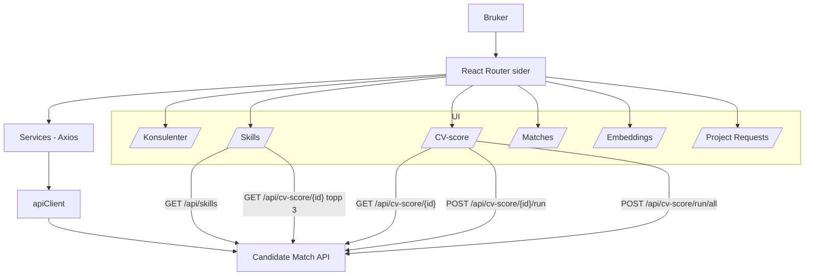
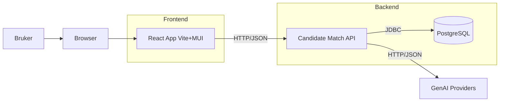
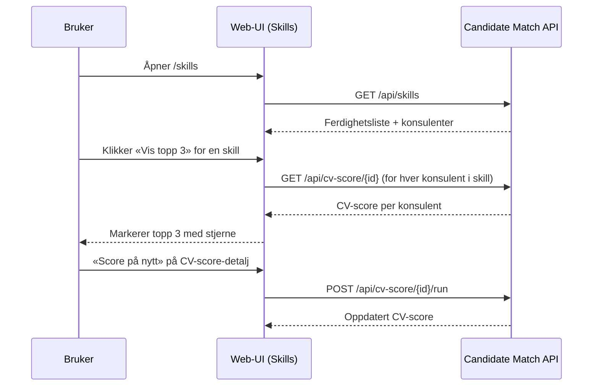
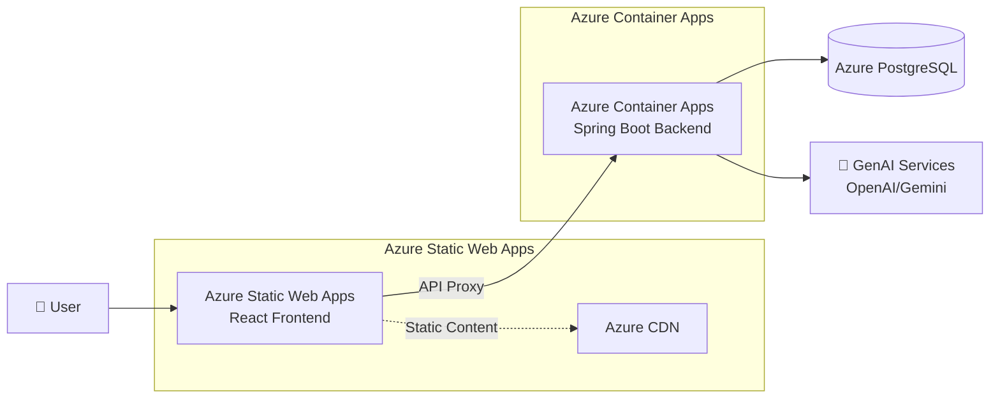

# Cloudberries Candidate Match – Web

Frontend-appen for Cloudberries Candidate Match. Denne webklienten lar deg:
- Se liste over konsulenter, og åpne detaljer/CV
- Se aggregerte ferdigheter (skills) i firma, filtrere på utvalgte ferdigheter, og markere «beste» konsulenter (topp 3) pr. skill basert på nylig CV-score
- Se og trigge CV-scoring for én kandidat eller for alle
- **🆕 AI-drevet chat-søk** med støtte for konversasjonshistorikk og multiple søkemodi (STRUCTURED, SEMANTIC, HYBRID, RAG)
- **🆕 Avansert matches-håndtering** med dekningsanalyse og AI-anbefaling av topp konsulenter
- Kjøres mot Candidate Match API definert i OpenAPI (openapi.yaml) i dette repoet

## Innhold
- Funksjonell oversikt
- Arkitektur (mermaid)
- Sider og navigasjon
- API-oversikt (funksjonell)
- Teknisk – kjøre lokalt, tester, generere typer fra OpenAPI

---

## Funksjonell oversikt
- Konsulenter
  - Liste med navnefilter, paginering i UI
  - Klikk på rad åpner konsulentdetaljer eller CV-visning
- Ferdigheter (Skills)
  - Aggregert oversikt fra backend (antall konsulenter per skill + hvilke konsulenter)
  - Filtrering: søkefelt + multi-select for spesifikke ferdigheter (sendes som `skill`-repeater i query)
  - «Vis topp 3» henter CV-score for konsulentene i valgt skill, og markerer topp tre (stjerne)
- CV-score
  - Liste over kandidater
  - Detaljside for én kandidat (med styrker/forbedringsområder)
  - Handlinger:
    - «Score på nytt» (én kandidat)
    - «Kjør scoring for alle» (alle konsulenter)
- **🆕 AI Chat-søk**
  - Naturlig språk-søk med automatisk routing til beste søkemodus
  - Konversasjonshistorikk med `conversationId` for oppfølgingsspørsmål
  - Støtte for konsulent-spesifikke spørsmål med RAG (Retrieval Augmented Generation)
  - Debug-informasjon og timing-data for analyse
- **🆕 Matches med dekningsanalyse**
  - Liste over prosjektforespørsler med fargekodede dekningsstatus (GREEN/YELLOW/RED)
  - AI-anbefalte topp konsulenter for hver forespørsel med relevanscore og begrunnelse
  - Expanderbar visning av topp 5 konsulenter per forespørsel

---

## Arkitektur



---

## Sider og navigasjon
- `/` – Hjem
- `/consultants` – Liste over konsulenter
- `/consultants/:userId` – Konsulentdetaljer
- `/cv/:userId` – CV-visning
- `/skills` – Ferdigheter (filtrering + topp 3)
- `/cv-score` – CV-score (liste)
- `/cv-score/:candidateId` – CV-score detaljer + «Score på nytt»
- `/matches`, `/embeddings`, `/project-requests/upload`, `/chat`, `/health` – øvrige verktøy

---

## API-oversikt (funksjonell)

| Path | Metode | Beskrivelse |
|------|--------|-------------|
| `/api/skills` | GET | Aggregert oversikt over ferdigheter i firma, inkl. antall og konsulenter. Støtter `skill=...` (repeater) for filtrering. |
| `/api/consultants` | GET | Paginert liste over konsulenter (navnefilter) |
| `/api/consultants/sync/run` | POST | Trigger manuell synk fra kilde (Flowcase) |
| `/api/consultants/search` | POST | Relasjonelt søk (strukturerte filtre) |
|| `/api/consultants/search/semantic` | POST | Semantisk (vektor) søk |
|| **`/api/chatbot/search`** | **POST** | **🆕 AI-drevet søk med naturlig språk og konversasjonshistorikk** |
|| **`/api/chatbot/analyze`** | **POST** | **🆕 Analyser innhold med AI** |
|| `/api/cv/{userId}` | GET | Hent rå CV-data for konsulent |
| `/api/embeddings/run/jason` | POST | Demo: generer embeddings for «Jason» |
| `/api/embeddings/run?userId&cvId` | POST | Generer embeddings for spesifikk bruker/CV |
| `/api/embeddings/run/missing` | POST | Batch: generer manglende embeddings |
| `/api/health` | GET | Helsesjekk |
| `/api/matches` | POST | Finn kandidatmatcher fra prosjektbeskrivelse |
| `/api/matches/upload` | POST | Last opp PDF og finn matcher |
|| `/api/matches/by-skills` | POST | Finn matcher basert på skills-liste |
|| **`/api/matches/requests`** | **GET** | **🆕 Liste prosjektforespørsler med dekningsinfo** |
|| **`/api/matches/requests/{id}/top-consultants`** | **GET** | **🆕 Hent AI-anbefalte topp konsulenter for forespørsel** |
| `/api/project-requests/upload` | POST | Last opp kundens prosjektforespørsel (PDF), trekk ut krav via AI |
| `/api/project-requests/{id}` | GET | Hent lagret prosjektforespørsel |
| `/api/cv-score/{candidateId}` | GET | Hent CV-score for kandidat |
| `/api/cv-score/{candidateId}` | POST | Kjør CV-scoring for kandidat |
| `/api/cv-score/run/all` | POST | Kjør CV-scoring for alle |
| `/api/cv-score/all` | GET | Liste over kandidater (for CV-score-vyer) |

Se mer detaljer i `openapi.yaml` i dette repoet.

---

## Teknisk

### Stack
- React + TypeScript + Vite, Material UI
- Axios-klient (`src/services/apiClient.ts`)
- React Router
- Tester: Vitest + @testing-library/react
- OpenAPI-typer: `openapi-typescript` (typer genereres fra openapi.yaml)

### Integrasjon med backend
- Alle API-kall går mot Candidate Match API (Spring Boot) via `VITE_API_BASE_URL` (default http://localhost:8080)
- `openapi.yaml` i dette repoet speiler backendens REST-kontrakt.
- Typer genereres inn i `src/api/generated.ts` og re-eksporteres fra `src/types/api.ts` for konsistens i resten av koden.
- Når backend endres:
  1. Kopier oppdatert spesifikasjon fra backend (per prosjektregler):
     ```bash path=null start=null
     cp ~/git/cloudberries-candidate-match/candidate-match/openapi.yaml ~/git/cloudberries-candidate-match-web/openapi.yaml
     ```
  2. Regenerer typer: 
     ```bash path=null start=null
     npm run gen:api
     ```
  3. Test at endringene ikke introduserer type-feil:
     ```bash path=null start=null
     npm run build
     ```

#### Viktige API-endringer
- **consultantId og chunkId**: Endret fra UUID-format til rene string-typer (oktober 2024)
  - Årsak: userId i systemet er ikke nødvendigvis gyldige UUID-er
  - Dette påvirker `SearchResult.consultantId` og `RAGSource.consultantId/chunkId`
  - Frontend-koden behandlet disse som strenger allerede, så ingen kodeendringer var nødvendig
- **🆕 AI Chat Search med konversasjonsstøtte** (oktober 2024)
  - `/api/chatbot/search` støtter nå `conversationId` for konversasjonshistorikk
  - Multiple søkemodi: STRUCTURED, SEMANTIC, HYBRID, RAG
  - Konsulent-spesifikke spørsmål med `consultantId` og `cvId` parametere
- **🆕 Matches API utvidelser** (oktober 2024)
  - `/api/matches/requests` - liste prosjektforespørsler med dekningsanalyse
  - `/api/matches/requests/{id}/top-consultants` - AI-anbefalte konsulenter
  - Ny `CoverageStatus` enum (GREEN, YELLOW, RED, NEUTRAL) for dekningsvisualisering

### Miljøvariabler
- `VITE_API_BASE_URL` (default: `http://localhost:8080`)

#### CV Quality Score Architecture
- **CV quality scores** are now **server-provided** through the backend's unified `cv_score.score_percent` integration
- **minQualityScore filtering** is performed **server-side** for optimal performance
- Client-side fallback enrichment has been removed - search results contain quality scores directly from the backend

### Helsesjekk struping (5 min)
- UI-komponenter deler en felles 5-minutters cache på tvers av faner (localStorage).
- Ekte side-reload (Cmd/Ctrl+R) bypasser TTL og utløser nøyaktig ett nettverkskall på tvers av faner (kortvarig lås koordinerer).
- Primær endepunkt: `/api/health`; fallback til `/actuator/health` hovedsakelig i lokal utvikling. Innenfor TTL returneres cachet data uten nye kall.

### Kjøre lokalt
````bash path=null start=null
npm install
npm run dev
````

### Bygge
````bash path=null start=null
npm run build
npm run preview
````

### Tester (Vitest)
````bash path=null start=null
npm run test       # kjør alle tester
npm run test:watch # watcher
````

### Generere typer fra OpenAPI (openapi.yaml)
- Vi bruker `openapi-typescript` for å generere `src/api/generated.ts`.
- Kjør: 
````bash path=null start=null
npm run gen:api
````
- Scriptet leser `openapi.yaml` i repo-roten og skriver til `src/api/generated.ts`.
- Applikasjonen re-eksporterer sentrale typer fra denne filen via `src/types/api.ts` for konsistens.

### Kode-struktur (utdrag)
````text path=null start=null
src/
  pages/         # React-sider (Consultants, Skills, CvScore, Matches, ProjectRequests, ...)
  services/      # API-kall (axios)
  components/    # UI-komponenter
  types/         # Typer som re-eksporterer fra OpenAPI generated
  api/           # generated.ts (fra openapi-typescript)
  assets/, utils/
````

### Arkitektur (C4-inspirert – frontend + backend)


---

## Typiske brukerflyter (sekvens)



---

## Azure Deployment

### 🚀 Current Deployment: Azure Static Web Apps (Production)

**Live URL**: https://delightful-meadow-056d48003.1.azurestaticapps.net/

**Backend API**: https://cloudberries-candidate-match-ca.whitesand-767916af.westeurope.azurecontainerapps.io/

#### Architecture Overview


#### Deployment Configuration
- **Frontend**: Azure Static Web Apps with automatic GitHub Actions deployment
- **Backend**: Azure Container Apps with Spring Boot application
- **Database**: Azure Database for PostgreSQL (production setup)
- **CI/CD**: GitHub Actions workflows for both frontend and backend

#### GitHub Actions Workflow
- **File**: `.github/workflows/azure-static-web-apps-delightful-meadow-056d48003.yml`
- **Triggers**: Push to `main` branch, PRs to `main`
- **Build**: Vite build outputting to `build/` directory
- **Deploy**: Automatic deployment via Azure Static Web Apps GitHub Action

#### Static Web Apps Configuration
**File**: `staticwebapp.config.json`
```json
{
  "routes": [
    {
      "route": "/api/actuator/*",
      "rewrite": "/actuator/{*}",
      "allowedRoles": ["anonymous"]
    },
    {
      "route": "/api/*",
      "allowedRoles": ["anonymous"]
    }
  ]
}
```

#### Vite Configuration for Azure
**File**: `vite.config.ts`
```typescript
export default defineConfig({
  plugins: [react()],
  build: {
    outDir: 'build',        // Azure SWA expects 'build' directory
    emptyOutDir: true
  },
  // ... rest of configuration
});
```

### 🔧 Deployment Process

#### Automatic Deployment
1. Push changes to `main` branch
2. GitHub Actions automatically triggers
3. Vite builds the app to `build/` directory
4. Azure Static Web Apps deploys the build
5. Backend API calls are proxied through SWA configuration

#### Manual Deployment Verification
```bash
# Local build test
npm ci
npm run build
npm run preview

# Verify build output
ls -la build/
# Should contain: index.html, assets/, vite.svg
```

#### Health Check URLs
```bash
# Frontend
curl https://delightful-meadow-056d48003.1.azurestaticapps.net/

# Backend (direct)
curl https://cloudberries-candidate-match-ca.whitesand-767916af.westeurope.azurecontainerapps.io/actuator/health

# Backend (through SWA proxy)
curl https://delightful-meadow-056d48003.1.azurestaticapps.net/api/actuator/health
```

### 🛠️ Development vs Production

| Environment | Frontend URL | Backend URL | Notes |
|-------------|-------------|-------------|-------|
| **Local** | http://localhost:5174 | http://localhost:8080 | Vite dev server with proxy |
| **Production** | https://delightful-meadow-056d48003.1.azurestaticapps.net/ | https://cloudberries-candidate-match-ca.whitesand-767916af.westeurope.azurecontainerapps.io/ | Azure Static Web Apps + Container Apps |

### 🔍 Troubleshooting Azure Deployment

#### Frontend Issues
- **Build fails**: Check `npm run build` locally
- **Wrong output directory**: Ensure Vite outputs to `build/` not `dist/`
- **API calls fail**: Verify `staticwebapp.config.json` routes
- **404 on refresh**: SPA fallback should be handled by Static Web Apps automatically

#### Backend Issues
- **Container won't start**: Check Container Apps logs in Azure Portal
- **API endpoints return 404**: Verify backend is running and healthy
- **CORS issues**: Backend should allow Static Web Apps domain

#### Monitoring
- **GitHub Actions**: Monitor workflow runs at https://github.com/thomasandersen77/cloudberries-candidate-match-web/actions
- **Azure Portal**: Check Static Web Apps and Container Apps health
- **Application Insights**: Monitor performance and errors (if configured)

### 📋 Legacy Deployment Options

#### Azure DevOps (container build og deploy) - Legacy
- Pipelinefil: `azure-pipelines.yml`
- Bygger Docker-image fra dette repoet, pusher til Azure Container Registry (ACR) og deployer til Azure Web App for Containers.
- Viktig: Back-end URL settes ved build via `VITE_API_BASE_URL` som Docker build-arg slik at Vite kan bake det inn i `dist`.

#### Container + Azure App Service (Linux) - Alternative
- Bygg først: `npm ci && npm run build`
- Pakk `build/` inn i en enkel Nginx-container
- Push til ACR og bind til App Service
- Husk at `VITE_API_BASE_URL` må settes ved build – Vite injiserer verdier på build-tid

---

## Vedlikehold og forbedringer
- Vurder å introdusere backend bulk-endepunkt for CV-score (`GET /api/cv-score?candidateId=...`) for å redusere antall API-kall ved «Vis topp 3».
- Fortsette å re-eksportere typer via `src/types/api.ts` for å skjerme resten av koden for endringer i OpenAPI.
- Flere tester på kritiske flyter (Skills-filter, topp 3-markering, scoring-knapper).
