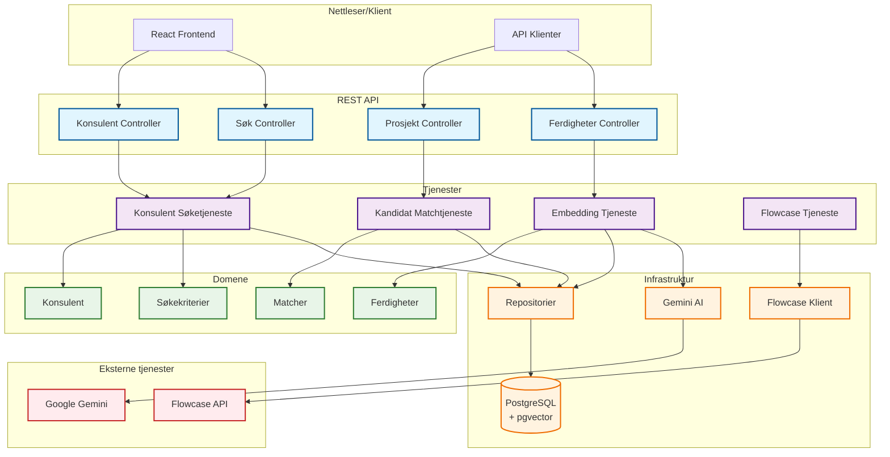
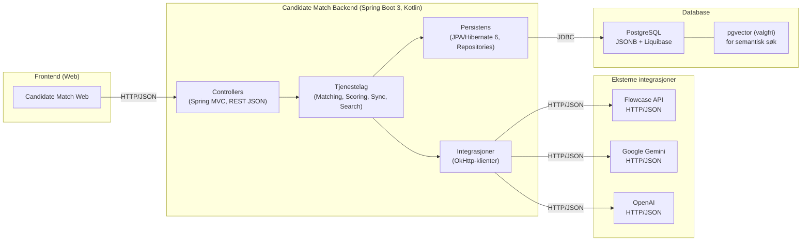

# Cloudberries Kandidatmatch

Avansert kandidatmatchingsystem som integrerer med Flowcase for CV-data, Google Gemini for innholdsgenerering og embeddings, og PostgreSQL/pgvector for vektorlagring. Systemet støtter både strukturert og semantisk søk for optimal kandidatmatching.

## Funksjonell oversikt

Systemet tilbyr to hovedtyper søk for kandidatmatching:

### 🔍 Strukturert søk (Relasjonelt)
Tradisjonnelt databasesøk basert på spesifikke kriterier:
- **Navnesøk**: Finn konsulenter basert på navn
- **Ferdighetssøk**: 
  - MÅ-krav: Konsulenter som har ALLE spesifiserte ferdigheter
  - BØR-krav: Konsulenter som har NOEN av de spesifiserte ferdighetene
- **Kvalitetsscore**: Minimum CV-kvalitetsscore
- **Aktive CV-er**: Filtrer kun på aktive CV-versjoner

### 🧠 Semantisk søk (AI-drevet)
Avansert søk som forstår naturlig språk og kontekst:
- **Naturlig språk**: Søk med vanlige setninger som "Senior Kotlin-utvikler med Spring-erfaring"
- **Kontekstforståelse**: AI-en forstår sammenhenger og relaterte begreper
- **Vektorsimilaritet**: Bruker pgvector for rask og presis matching
- **Kombinert filtrering**: Kan kombineres med kvalitetsscore og andre filtre

### 📊 Eksempler på bruksområder

**Strukturert søk:**
```json
{
  "skillsAll": ["KOTLIN", "SPRING"],
  "skillsAny": ["ARCHITECTURE", "TECH_LEAD"],
  "minQualityScore": 85
}
```
*"Konsulenter som KAN Kotlin og Spring, og som OGSÅ har arkitektur- eller tech-lead-erfaring, med score over 85"*

**Semantisk søk:**
```json
{
  "text": "Erfaren fullstack-utvikler som kan mentorere juniorer",
  "topK": 5
}
```
*"5 beste konsulenter basert på semantisk matching av beskrivelsen"*

## Arkitektur


## Forutsetninger (macOS, zsh)

- Java 21.0.7 Temurin (installer via SDKMAN)
- Maven (installer via SDKMAN) — prosjektet inkluderer også Maven Wrapper (mvnw)
- Docker (for å kjøre PostgreSQL eller Testcontainers-baserte integrasjonstester)

Installer SDKMAN, Java og Maven:

```bash
curl -s "https://get.sdkman.io" | bash
source "$HOME/.sdkman/bin/sdkman-init.sh"
sdk install java 21.0.7-tem
sdk install maven
```

## Konfigurasjon

Applikasjonsinnstillinger lastes fra miljøvariabler (foretrukket) eller application YAML-filer. Hovednøklene:

- FLOWCASE_API_KEY
- FLOWCASE_BASE_URL
- OPENAI_API_KEY
- OPENAI_ASSISTANT_ID
- GEMINI_API_KEY

Embedding-konfigurasjon (standardverdier i application.yaml):

- embedding.enabled: false (aktiver i lokal profil)
- embedding.provider: GEMINI
- embedding.model: text-embedding-004
- embedding.dimension: 768

Lokal profil (application-local.yaml) konfigurerer også Liquibase-kontekst "pgvector" og en lokal Postgres URL:

- spring.datasource.url: jdbc:postgresql://localhost:5433/candidatematch
- spring.datasource.username: ${POSTGRES_USER}
- spring.datasource.password: ${POSTGRES_PASSWORD}

Eksporter miljøvariabler i zsh (legg til ~/.zshrc for varig lagring):

```bash
export FLOWCASE_API_KEY={{din_flowcase_api_nøkkel}}
export FLOWCASE_BASE_URL={{din_flowcase_base_url}}
export OPENAI_API_KEY={{din_openai_api_nøkkel}}
export OPENAI_ASSISTANT_ID={{din_openai_assistant_id}}
export GEMINI_API_KEY={{din_gemini_api_nøkkel}}
export POSTGRES_USER=candidatematch
export POSTGRES_PASSWORD=candidatematch123
```

## Database (lokal)

Den lokale profilen forventer PostgreSQL på localhost:5433. Alternativer:

- Bruk Docker direkte:

```bash
docker run --name candidate-postgres -e POSTGRES_DB=candidatematch \
  -e POSTGRES_USER=candidatematch -e POSTGRES_PASSWORD=candidatematch123 \
  -p 5433:5432 -d postgres:15-alpine
```

- Eller bruk docker-compose.yml (standard mapper 5432:5432) og enten:
    - Oppdater application-local.yaml til å peke på 5432, eller
    - Overstyr ved kjøretid: SPRING_DATASOURCE_URL=jdbc:postgresql://localhost:5432/candidatematch

Liquibase oppretter skjemaer/tabeller ved oppstart. pgvector-utvidelsen og tabeller brukt for embeddings er avgrenset av
"pgvector" Liquibase-kontekst, som er aktivert i den lokale profilen.

## Rask oppstart

- Kjør kun enhetstester (hopp over integrasjonstester):

```bash
mvn -q -DskipITs=true clean test
```

- Kjør integrasjonstester (krever Docker og Testcontainers, inkludert pgvector IT):

```bash
mvn -q -DskipITs=false -DrunPgVectorIT=true clean verify
```

- Start appen lokalt (bruker lokal profil og aktiverer embeddings):

```bash
mvn -q spring-boot:run -Dspring-boot.run.profiles=local
```

## API-endepunkter

Når appen kjører (standard http://localhost:8080), kan du bruke følgende endepunkter:

### 🔍 Søkeendepunkter

**Strukturert søk (paginering i body):**
```bash
curl -X POST http://localhost:8080/api/consultants/search \
  -H "Content-Type: application/json" \
  -d '{
    "name": "John",
    "skillsAll": ["KOTLIN"],
    "skillsAny": ["JAVA", "SPRING"],
    "minQualityScore": 80,
    "onlyActiveCv": true,
    "pagination": { "page": 0, "size": 10, "sort": ["name,asc"] }
  }'
```

**Semantisk søk (paginering i body):**
```bash
curl -X POST http://localhost:8080/api/consultants/search/semantic \
  -H "Content-Type: application/json" \
  -d '{
    "text": "Senior Kotlin-utvikler med Spring-erfaring",
    "topK": 5,
    "minQualityScore": 80,
    "pagination": { "page": 0, "size": 10, "sort": ["name,asc"] }
  }'
```

**Embedding-informasjon:**
```bash
curl http://localhost:8080/api/consultants/search/embedding-info
```

### 🧠 Embedding-endepunkter

**Generer Jason's embedding (demo):**
```bash
curl -X POST http://localhost:8080/api/embeddings/run/jason
```

**Generer for spesifikk konsulent:**
```bash
curl -X POST "http://localhost:8080/api/embeddings/run?userId=thomas&cvId=andersen"
```

**Prosesser manglende embeddings i batch:**
```bash
curl -X POST "http://localhost:8080/api/embeddings/run/missing?batchSize=100"
```

Krav for ekte embeddings:

- embedding.enabled=true (i lokal profil)
- GEMINI_API_KEY satt
- Embedding-modell standard til text-embedding-004 og dimensjon 768

## Notater om tester og helsesjekker

- Testnavn-mønstre: enhetstester "*Test"; integrasjonstester "*IT" eller "*IntegrationTest" (Failsafe).
- pgvector integrasjonstesten CvEmbeddingRepositoryIT er beskyttet av system-egenskapen runPgVectorIT=true for å unngå
  feil når Docker ikke er tilgjengelig.
- Under testkjøringer kan du se helsesjekk-feillogger (database, Flowcase, GenAI). Disse er forventet i isolerte test-
  kontekster og indikerer ikke en feilende bygging med mindre tester eksplisitt avhenger av disse sjekkene.

## macOS tips

- På Apple Silicon kan Embedded Postgres brukt i noen tester bruke amd64-binærer via Rosetta. Installer Rosetta om nødvendig:

```bash
sudo softwareupdate --install-rosetta
```

## Teknisk arkitektur

Teknologier: Kotlin, Spring Boot 3, Spring MVC, Liquibase, Hibernate 6 + Hypersistence (JSON/JSONB), OkHttp, springdoc-openapi,
PostgreSQL, pgvector, Testcontainers for tester.

```bash
softwareupdate --install-rosetta --agree-to-license
```

## Troubleshooting

- Connection refused to Postgres on startup: ensure your container is running and the port matches your datasource URL (
  5433 by default in application-local.yaml).
- Empty embeddings returned: verify GEMINI_API_KEY is set and embedding.enabled=true.
- Flowcase stubs vs real API: tests stub Flowcase; for local runs ensure FLOWCASE_BASE_URL and FLOWCASE_API_KEY are
  configured for your environment.

---

## Funksjonell oversikt

Tjenesten støtter følgende hovedflyter:

- Synkronisering fra Flowcase
  - Henter brukere og standard CV-id-er fra Flowcase API
  - Laster full CV (JSON) per bruker og lagrer i databasen (consultant.resume_data som JSONB)
  - Avleder og lagrer kompetanser (skills) som relasjoner
  - Kan generere embeddings for semantisk søk (pgvector) når aktivert
- Kompetanseoversikt
  - Aggregerer antall konsulenter per kompetanse og lister konsulenter med kompetansen
  - Brukes i frontend for filtrering/valg i dropdown
- Matching
  - Matcher kandidater fra CV/tekst mot behov (tekst), eller direkte basert på valgte kompetanser
  - Støtter opplasting av PDF
- CV-scoring
  - Skårer CV-er (enkelt-kandidat eller alle) og eksponerer resultater via API
- Helse
  - Sammensatt helse-sjekk for databasen, eksterne integrasjoner (Flowcase/GenAI), og konfigurasjon


## Intern arkitektur (C4-inspirert)



Teknologier: Kotlin, Spring Boot 3, Spring MVC, Liquibase, Hibernate 6 + Hypersistence (JSON/JSONB), OkHttp, springdoc-openapi,
PostgreSQL, pgvector (opsjon), Testcontainers/Zonky for tester.


## OpenAPI og genererte typer

Merk: For ferdighetsendepunktet (SkillInCompanyDto) er feltet consultantCount introdusert som foretrukket felt for antall konsulenter. Feltet konsulenterMedSkill beholdes midlertidig for bakoverkompatibilitet (deprecated i OpenAPI).

- OpenAPI-spesifikasjonen ligger i rotmappen: `openapi.yaml`
- Når appen kjører lokalt, kan spesifikasjonen også hentes fra Springdoc:
  - JSON: `http://localhost:8080/v3/api-docs`
  - YAML: `http://localhost:8080/v3/api-docs.yaml`
  - Swagger UI: `http://localhost:8080/swagger-ui/index.html`

Synkronisere spesifikasjon og generere typer i frontend (cloudberries-candidate-match-web):

```bash
# Fra backend-repoet
cp openapi.yaml ../cloudberries-candidate-match-web/openapi.yaml
npm --prefix ../cloudberries-candidate-match-web run gen:api
```

Alternativt kan frontend hente direkte fra kjørende backend:

```bash
curl -s http://localhost:8080/v3/api-docs.yaml > ../cloudberries-candidate-match-web/openapi.yaml
npm --prefix ../cloudberries-candidate-match-web run gen:api
```

Generere TypeScript-klient (valgfritt, OpenAPI Generator):

```bash
# Installer via Homebrew (eller bruk Docker image openapitools/openapi-generator-cli)
brew install openapi-generator

# Generer fetch-basert TS-klient (juster output-katalog)
openapi-generator generate \
  -i openapi.yaml \
  -g typescript-fetch \
  -o generated/typescript-fetch \
  --additional-properties=supportsES6=true
```

Generere Kotlin-klient (for interne kall eller andre tjenester):

```bash
openapi-generator generate \
  -i openapi.yaml \
  -g kotlin \
  -o generated/kotlin-client
```

Tips:
- Hold `openapi.yaml` i sync med implementasjonen. Ved behov kan du eksportere ny YAML fra `v3/api-docs.yaml`:
  `curl -s http://localhost:8080/v3/api-docs.yaml > openapi.yaml`
- Frontend kan også generere klient direkte fra `http://localhost:8080/v3/api-docs.yaml` i CI.


## API-endepunkter (funksjonell oversikt)

Ekstra: Konsulenter med normaliserte CV-typer

- GET /api/consultants/with-cv
  - Returnerer alle konsulenter med tilhørende CV-er og normaliserte under-typer (keyQualifications, education, workExperience, projectExperience m/roles og skills, certifications, courses, languages, skillCategories m/skills, attachments)
  - Valgfri query-parameter: onlyActiveCv=true for å kun inkludere aktive CV-er

Eksempel:

```bash
curl -s "http://localhost:8080/api/consultants/with-cv?onlyActiveCv=true" | jq '.[:1]'
```

| Metode | Path                              | Controller                      | Method                         | Input (kort)                                 | Output (kort) | Formål (funksjonelt)                                                |
|-------:|-----------------------------------|--------------------------------|--------------------------------|----------------------------------------------|---------------|---------------------------------------------------------------------|
| GET    | /api/skills                       | SkillsController               | listSkills                     | query: skill[]=KOTLIN,…                      | Aggregater    | Aggregerer og lister kompetanser i selskapet                       |
| POST   | /api/chatbot/analyze              | AIController                   | analyzeContent                 | JSON: { content }                            | AI-respons    | Analyserer tekst med AI                                             |
|| GET    | /api/consultants                  | ConsultantController           | list                           | query: name, page/size/sort                  | Page<Consultant> | Lister konsulenter (paginert, filtrerbart på navn)                 |
|| POST   | /api/consultants/search           | ConsultantController           | searchRelational               | –                                          | JSON: RelationalSearchRequest + pagination | Relasjonelt søk (paginering i body) |
|| POST   | /api/consultants/search/semantic  | ConsultantController           | searchSemantic                 | –                                          | JSON: SemanticSearchRequest + pagination   | Semantisk søk (paginering i body) |
| GET    | /api/consultants/with-cv          | ConsultantCvQueryController    | getAllWithCv                   | query: onlyActiveCv?                           | Liste         | Lister alle konsulenter med normaliserte CV-data                    |
| POST   | /api/consultants/sync/run         | ConsultantSyncController       | syncAll                        | –                                            | Sammendrag    | Kjører synk fra Flowcase                                            |
| GET    | /api/cv/{userId}                  | CvController                   | getCv                          | path: userId                                  | CV JSON       | Henter CV-data (JSON) for gitt bruker                               |
| POST   | /api/embeddings/run/jason         | EmbeddingController            | runJason                       | –                                            | Resultat      | Demo: generér embeddings for «Jason»                                |
| POST   | /api/embeddings/run               | EmbeddingController            | runForUserCv                   | query: userId, cvId                           | Resultat      | Generér embeddings for spesifikk bruker/CV                          |
| POST   | /api/embeddings/run/missing       | EmbeddingController            | runMissing                     | query: batchSize                              | Resultat      | Generér embeddings for manglende i batch                            |
| GET    | /api/health                       | HealthController               | healthCheck                    | –                                            | Status        | Helse-sjekk (aggregert)                                              |
| POST   | /api/matches                      | MatchingController             | findMatches                    | JSON: { projectRequestText }                 | Matcher       | Finn matcher fra prosjektbeskrivelse (tekst)                        |
| POST   | /api/matches/upload               | MatchingController             | findMatchesFromPdf             | multipart: file, projectRequestText           | Matcher       | Last opp CV (PDF) og finn matcher                                   |
| GET    | /api/project-requests             | ProjectRequestController       | listAll                        | –                                            | Liste         | List lagrede kundeforespørsler (kompakt/aggregert)                  |
| POST   | /api/project-requests/upload      | ProjectRequestController       | uploadAndAnalyze               | multipart: file                               | Forespørsel   | Last opp og analyser kundeforespørsel (PDF)                         |
| GET    | /api/project-requests/{id}        | ProjectRequestController       | getById                        | path: id                                      | Forespørsel   | Hent lagret kundeforespørsel                                        |
| GET    | /api/cv-score/{candidateId}       | CvScoreController              | getCvScoreForCandidate         | path: candidateId                             | Score DTO     | Hent CV-score for kandidat                                          |
| POST   | /api/cv-score/{candidateId}/run   | CvScoreController              | runScoreForCandidate           | path: candidateId                             | Score DTO     | Kjør CV-score for kandidat                                          |
| POST   | /api/cv-score/run/all             | CvScoreController              | runScoreForAll                 | –                                            | Sammendrag    | Kjør CV-score for alle                                              |
| GET    | /api/cv-score/all                 | CvScoreController              | getAllCandidates               | –                                            | Liste         | List alle kandidater (oversikt)                                     |
