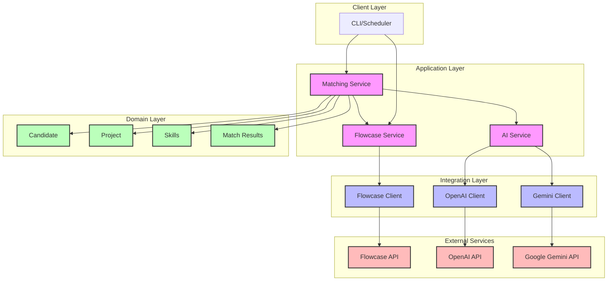

```mermaid
graph TB
    subgraph Frontend["Client Layer"]
        CLI["CLI/Scheduler"]
    end

    subgraph Application["Application Layer"]
        MS["Matching Service"]
        FS["Flowcase Service"]
        AS["AI Service"]
    end

    subgraph Integration["Integration Layer"]
        FC["Flowcase Client"]
        OAI["OpenAI Client"]
        GEM["Gemini Client"]
    end

    subgraph External["External Services"]
        FAPI["Flowcase API"]
        OAPI["OpenAI API"]
        GAPI["Google Gemini API"]
    end

    subgraph Domain["Domain Layer"]
        CAN["Candidate"]
        PROJ["Project"]
        SKILL["Skills"]
        MATCH["Match Results"]
    end

    %% Connections
    CLI --> MS
    CLI --> FS
    
    MS --> AS
    MS --> FS
    
    FS --> FC
    AS --> OAI
    AS --> GEM
    
    FC --> FAPI
    OAI --> OAPI
    GEM --> GAPI
    
    MS --> CAN
    MS --> PROJ
    MS --> SKILL
    MS --> MATCH

    %% Styling
    classDef service fill:#f9f,stroke:#333,stroke-width:2px
    classDef client fill:#bbf,stroke:#333,stroke-width:2px
    classDef external fill:#fbb,stroke:#333,stroke-width:2px
    classDef domain fill:#bfb,stroke:#333,stroke-width:2px
    
    class MS,FS,AS service
    class FC,OAI,GEM client
    class FAPI,OAPI,GAPI external
    class CAN,PROJ,SKILL,MATCH domain
```