# Cloudberries Candidate Match – Web

Frontend-appen for Cloudberries Candidate Match. Denne webklienten lar deg:
- Se liste over konsulenter, og åpne detaljer/CV
- Se aggregerte ferdigheter (skills) i firma, filtrere på utvalgte ferdigheter, og markere «beste» konsulenter (topp 3) pr. skill basert på nylig CV-score
- Se og trigge CV-scoring for én kandidat eller for alle
- **🆕 AI-drevet chat-søk** med støtte for konversasjonshistorikk og multiple søkemodi (STRUCTURED, SEMANTIC, HYBRID, RAG)
- **🆕 Avansert matches-håndtering** med dekningsanalyse og AI-anbefaling av topp konsulenter
- Kjøres mot Candidate Match API definert i OpenAPI (openapi.yaml) i dette repoet

## Innhold
- Funksjonell oversikt
- Arkitektur (mermaid)
- Sider og navigasjon
- API-oversikt (funksjonell)
- Teknisk – kjøre lokalt, tester, generere typer fra OpenAPI

---

## Funksjonell oversikt
- Konsulenter
  - Liste med navnefilter, paginering i UI
  - Klikk på rad åpner konsulentdetaljer eller CV-visning
- Ferdigheter (Skills)
  - Aggregert oversikt fra backend (antall konsulenter per skill + hvilke konsulenter)
  - Filtrering: søkefelt + multi-select for spesifikke ferdigheter (sendes som `skill`-repeater i query)
  - «Vis topp 3» henter CV-score for konsulentene i valgt skill, og markerer topp tre (stjerne)
- CV-score
  - Liste over kandidater
  - Detaljside for én kandidat (med styrker/forbedringsområder)
  - Handlinger:
    - «Score på nytt» (én kandidat)
    - «Kjør scoring for alle» (alle konsulenter)
- **🆕 AI Chat-søk**
  - Naturlig språk-søk med automatisk routing til beste søkemodus
  - Konversasjonshistorikk med `conversationId` for oppfølgingsspørsmål
  - Støtte for konsulent-spesifikke spørsmål med RAG (Retrieval Augmented Generation)
  - Debug-informasjon og timing-data for analyse
- **🆕 Matches med dekningsanalyse**
  - Liste over prosjektforespørsler med fargekodede dekningsstatus (GREEN/YELLOW/RED)
  - AI-anbefalte topp konsulenter for hver forespørsel med relevanscore og begrunnelse
  - Expanderbar visning av topp 5 konsulenter per forespørsel

---

## Arkitektur


---

## Sider og navigasjon
- `/` – Hjem
- `/consultants` – Liste over konsulenter
- `/consultants/:userId` – Konsulentdetaljer
- `/cv/:userId` – CV-visning
- `/skills` – Ferdigheter (filtrering + topp 3)
- `/cv-score` – CV-score (liste)
- `/cv-score/:candidateId` – CV-score detaljer + «Score på nytt»
- `/matches`, `/embeddings`, `/project-requests/upload`, `/chat`, `/health` – øvrige verktøy

---

## API-oversikt (funksjonell)

| Path | Metode | Beskrivelse |
|------|--------|-------------|
| `/api/skills` | GET | Aggregert oversikt over ferdigheter i firma, inkl. antall og konsulenter. Støtter `skill=...` (repeater) for filtrering. |
| `/api/consultants` | GET | Paginert liste over konsulenter (navnefilter) |
| `/api/consultants/sync/run` | POST | Trigger manuell synk fra kilde (Flowcase) |
| `/api/consultants/search` | POST | Relasjonelt søk (strukturerte filtre) |
|| `/api/consultants/search/semantic` | POST | Semantisk (vektor) søk |
|| **`/api/chatbot/search`** | **POST** | **🆕 AI-drevet søk med naturlig språk og konversasjonshistorikk** |
|| **`/api/chatbot/analyze`** | **POST** | **🆕 Analyser innhold med AI** |
|| `/api/cv/{userId}` | GET | Hent rå CV-data for konsulent |
| `/api/embeddings/run/jason` | POST | Demo: generer embeddings for «Jason» |
| `/api/embeddings/run?userId&cvId` | POST | Generer embeddings for spesifikk bruker/CV |
| `/api/embeddings/run/missing` | POST | Batch: generer manglende embeddings |
| `/api/health` | GET | Helsesjekk |
| `/api/matches` | POST | Finn kandidatmatcher fra prosjektbeskrivelse |
| `/api/matches/upload` | POST | Last opp PDF og finn matcher |
|| `/api/matches/by-skills` | POST | Finn matcher basert på skills-liste |
|| **`/api/matches/requests`** | **GET** | **🆕 Liste prosjektforespørsler med dekningsinfo** |
|| **`/api/matches/requests/{id}/top-consultants`** | **GET** | **🆕 Hent AI-anbefalte topp konsulenter for forespørsel** |
| `/api/project-requests/upload` | POST | Last opp kundens prosjektforespørsel (PDF), trekk ut krav via AI |
| `/api/project-requests/{id}` | GET | Hent lagret prosjektforespørsel |
| `/api/cv-score/{candidateId}` | GET | Hent CV-score for kandidat |
| `/api/cv-score/{candidateId}` | POST | Kjør CV-scoring for kandidat |
| `/api/cv-score/run/all` | POST | Kjør CV-scoring for alle |
| `/api/cv-score/all` | GET | Liste over kandidater (for CV-score-vyer) |

Se mer detaljer i `openapi.yaml` i dette repoet.

---

## Teknisk

### Stack
- React + TypeScript + Vite, Material UI
- Axios-klient (`src/services/apiClient.ts`)
- React Router
- Tester: Vitest + @testing-library/react
- OpenAPI-typer: `openapi-typescript` (typer genereres fra openapi.yaml)

### Integrasjon med backend
- Alle API-kall går mot Candidate Match API (Spring Boot) via `VITE_API_BASE_URL` (default http://localhost:8080)
- `openapi.yaml` i dette repoet speiler backendens REST-kontrakt.
- Typer genereres inn i `src/api/generated.ts` og re-eksporteres fra `src/types/api.ts` for konsistens i resten av koden.
- Når backend endres:
  1. Kopier oppdatert spesifikasjon fra backend (per prosjektregler):
     ```bash path=null start=null
     cp ~/git/cloudberries-candidate-match/candidate-match/openapi.yaml ~/git/cloudberries-candidate-match-web/openapi.yaml
     ```
  2. Regenerer typer: 
     ```bash path=null start=null
     npm run gen:api
     ```
  3. Test at endringene ikke introduserer type-feil:
     ```bash path=null start=null
     npm run build
     ```

#### Viktige API-endringer
- **consultantId og chunkId**: Endret fra UUID-format til rene string-typer (oktober 2024)
  - Årsak: userId i systemet er ikke nødvendigvis gyldige UUID-er
  - Dette påvirker `SearchResult.consultantId` og `RAGSource.consultantId/chunkId`
  - Frontend-koden behandlet disse som strenger allerede, så ingen kodeendringer var nødvendig
- **🆕 AI Chat Search med konversasjonsstøtte** (oktober 2024)
  - `/api/chatbot/search` støtter nå `conversationId` for konversasjonshistorikk
  - Multiple søkemodi: STRUCTURED, SEMANTIC, HYBRID, RAG
  - Konsulent-spesifikke spørsmål med `consultantId` og `cvId` parametere
- **🆕 Matches API utvidelser** (oktober 2024)
  - `/api/matches/requests` - liste prosjektforespørsler med dekningsanalyse
  - `/api/matches/requests/{id}/top-consultants` - AI-anbefalte konsulenter
  - Ny `CoverageStatus` enum (GREEN, YELLOW, RED, NEUTRAL) for dekningsvisualisering

### Miljøvariabler
- `VITE_API_BASE_URL` (default: `http://localhost:8080`)

#### CV Quality Score Architecture
- **CV quality scores** are now **server-provided** through the backend's unified `cv_score.score_percent` integration
- **minQualityScore filtering** is performed **server-side** for optimal performance
- Client-side fallback enrichment has been removed - search results contain quality scores directly from the backend

### Kjøre lokalt
````bash path=null start=null
npm install
npm run dev
````

### Bygge
````bash path=null start=null
npm run build
npm run preview
````

### Tester (Vitest)
````bash path=null start=null
npm run test       # kjør alle tester
npm run test:watch # watcher
````

### Generere typer fra OpenAPI (openapi.yaml)
- Vi bruker `openapi-typescript` for å generere `src/api/generated.ts`.
- Kjør: 
````bash path=null start=null
npm run gen:api
````
- Scriptet leser `openapi.yaml` i repo-roten og skriver til `src/api/generated.ts`.
- Applikasjonen re-eksporterer sentrale typer fra denne filen via `src/types/api.ts` for konsistens.

### Kode-struktur (utdrag)
````text path=null start=null
src/
  pages/         # React-sider (Consultants, Skills, CvScore, Matches, ProjectRequests, ...)
  services/      # API-kall (axios)
  components/    # UI-komponenter
  types/         # Typer som re-eksporterer fra OpenAPI generated
  api/           # generated.ts (fra openapi-typescript)
  assets/, utils/
````

### Arkitektur (C4-inspirert – frontend + backend)


---

## Typiske brukerflyter (sekvens)

```mermaid
sequenceDiagram
  participant U as Bruker
  participant UI as Web-UI (Skills)
  participant API as Candidate Match API

  U->>UI: Åpner /skills
  UI->>API: GET /api/skills
  API-->>UI: Ferdighetsliste + konsulenter

  U->>UI: Klikker «Vis topp 3» for en skill
  UI->>API: GET /api/cv-score/{id} (for hver konsulent i skill)
  API-->>UI: CV-score per konsulent
  UI-->>U: Markerer topp 3 med stjerne

  U->>UI: «Score på nytt» på CV-score-detalj
  UI->>API: POST /api/cv-score/{id}/run
  API-->>UI: Oppdatert CV-score
```



---

## Kjøre i Azure

### Azure DevOps (container build og deploy)
- Pipelinefil: `azure-pipelines.yml`
- Bygger Docker-image fra dette repoet, pusher til Azure Container Registry (ACR) og deployer til Azure Web App for Containers.
- Viktig: Back-end URL settes ved build via `VITE_API_BASE_URL` som Docker build-arg slik at Vite kan bake det inn i `dist`.

Variabler som må settes i pipeline (Library/Variable Group eller YAML):
- `azureSubscription`: Service connection til Azure
- `registryServiceConnection`: Docker registry service connection til ACR
- `acrLoginServer`: f.eks. `myregistry.azurecr.io`
- `appServiceName`: Navn på Azure Web App (Container)
- `imageName`: f.eks. `candidate-match-web`
- `VITE_API_BASE_URL`: f.eks. `https://my-backend-app.azurewebsites.net`

### Alternativ A: Azure Static Web Apps (anbefalt for SPA)
- Bygger og hoster statiske filer fra `dist/`
- Backend kan stå som egen app (for eksempel Azure App Service); sett `VITE_API_BASE_URL` til backendens offentlige URL under bygg.

Steg (GUI):
1. Opprett en «Static Web App» i Azure Portal
2. Koble til GitHub-repoet
3. Build presets: Custom
   - App location: `/`
   - API location: (tom)
   - Output location: `dist`
4. Legg til miljøvariabel i bygg-jobb: `VITE_API_BASE_URL=https://<din-backend-host>`

Lokal verifisering før deploy:
```bash path=null start=null
npm ci
npm run build
npx serve -s dist -l 5173
```

### Alternativ B: Container + Azure App Service (Linux)
- Bygg først: `npm ci && npm run build`
- Pakk `dist/` inn i en enkel Nginx-container, for eksempel:
```Dockerfile path=null start=null
FROM nginx:alpine
COPY dist/ /usr/share/nginx/html
# Evt. legg til en enkel fallback for SPA-ruter
```
- Push til ACR og bind til App Service.
- Husk at `VITE_API_BASE_URL` må settes ved build – Vite injiserer verdier på build-tid.

---

## Vedlikehold og forbedringer
- Vurder å introdusere backend bulk-endepunkt for CV-score (`GET /api/cv-score?candidateId=...`) for å redusere antall API-kall ved «Vis topp 3».
- Fortsette å re-eksportere typer via `src/types/api.ts` for å skjerme resten av koden for endringer i OpenAPI.
- Flere tester på kritiske flyter (Skills-filter, topp 3-markering, scoring-knapper).
