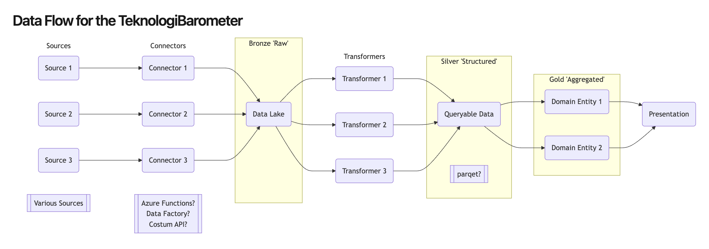
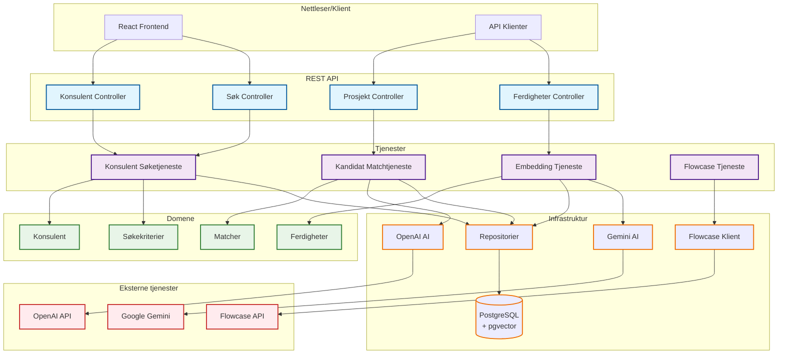
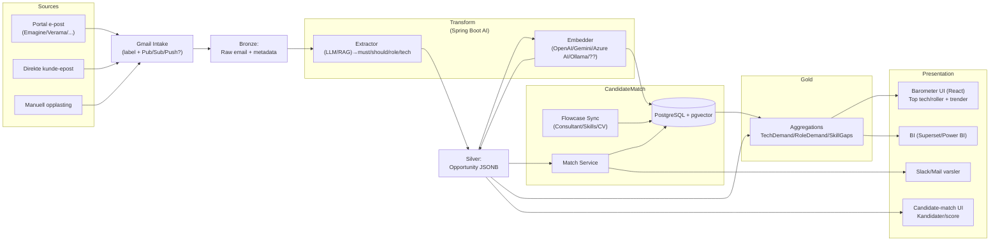

# Teknologibarometer Arkitektur forslag

Slik jeg forstår det, ønsker man en arkitektur for en teknologibarometer-app som kan analysere og visualisere etterspørsel etter teknologier, roller og kompetanse basert på innkommende forespørsler. 
Det var nevnt integrasjon med Flowcase, LinkedIn med mer. Her er et forslag til hvordan en slik arkitektur kan se ut, med fokus på inntak, behandling, lagring og presentasjon av data.

**LinkedIn-integrasjon (Recruiting & nettverk):** I tillegg til Flowcase kan Candidate‑match konsumere LinkedIn‑data for rekruttering på samme måte som den gjøre Flowcase (scheduled updates/tv).
: via LinkedIn API/Recruiter‑eksport synker vi kandidater ("Candidate") og profiler, inkl. navn, overskrift, lokasjon, erfaring, utdanning og nøkkelord/skills. Data mappes til Candidate‑match sitt domenespråk (Candidate, Skills, Experience) og lagres side om side med Flowcase‑konsulenter. Dette muliggjør automatisert kandidat‑inntak, løpende oppdatering og semantisk søk/match i samme motor (pgvector/LLM). Inntaket kan trigges på e‑post/lenker eller batch‑eksport, og styres av samtykke/rate‑limits. Teknologibarometeret kan bruke disse profilene både til å måle etterspørsel vs. tilbud (skill‑gap) og til å presentere toppkandidater for innkomne forespørsler.

### Foreslått overordnet flyt for teknologibarometer-appen

Tok utgangspunkt i forslaget Gulikk sitt og laget en mer detaljert arkitektur med fokus på inntak, behandling, lagring og presentasjon av data. 
Samt hvordan vi kan får en flyingstart med candidate-match for teknologibarometer.
    
 

* Teknologibarometeret blir én felles innsiktskilde: kontinuerlig analyse av innkomne forespørsler (e-post/portaler) → trender på teknologier, roller og kompetanse.
* Candidate-match gjenbrukes som motor: Flowcase-data (konsulenter/skills/CV), embeddings/LLM (OpenAI/Gemini/Ollama), matching og allerede eksisterende React-frontend.
* Inntak via Gmail (intake@cloudberries.no) + AI-ekstraksjon gir må/bør-krav som strukturerte JSON-objekter (Opportunity), lagres i Bronze/Silver/Gold og eksponeres til UI/BI.
* MVP raskt: e-post-ingest for 3–5 kilder, daglige topp-lister/trender, Slack-varsler og “topp-5 kandidater” fra Candidate-match.

## Candidate Match (kort)

Avansert kandidatmatchingsystem som integrerer med Flowcase for CV-data, Google Gemini for innholdsgenerering og embeddings, og PostgreSQL/pgvector for vektorlagring. Systemet støtter både strukturert og semantisk søk for optimal kandidatmatching.
Integrerer med 3 LLMs, OpenAI API, Google Gemini API og Ollama (for lokal kjøring av modeller). Bruker pgvector for effektiv vektorsøk i PostgreSQL. Har en React-basert frontend for brukerinteraksjon.

Se [README.md](@file:README.md) for fullstendig beskrivelse av Candidate Match.

### Arkitektur

### Tidlig arkitektur – Teknologibarometer + Candidate-match (foreslått)

## Akseptansekriterier for en mulig MVP

### Inntak & kilder
1.	Gmail-inntak på intake@cloudberries.no med labels per portal; push via Pub/Sub (fallback: polling).
2.	Kildedekning: Minst 3 portaler i drift (f.eks. Emagine, Verama, Knowit).
3.	Parsing-treff: ≥ 80 % av e-poster mappes automatisk til gyldig Opportunity JSON (resten flagges til manuell korreksjon).
4.	Idempotens & deduplisering: Samme forespørsel opprettet maks 1 gang (Message-ID/sha-hash).
5.	Tidslinje: Hendelse → synlig i Silver/Queryable innen ≤ 5 min (p50).

### Ekstraksjon & struktur
6.	RAG-ekstraksjon produserer feltene: must_have[], nice_to_have[], role, tech_stack, language, clearance, location, deadline.
7.	Kvalitetsmål: På definert “golden set” (10–20 e-poster) treffer ekstraksjon ≥ 85 % korrekt på must_have og role.
8.	Skjemakontrakt: Opportunity JSON valideres mot schema; feilede meldinger logges med årsak.

### Lagring & modeller
9.	Bronze: rå e-post (metadata + renset tekst/vedlegg) med sporbarhet (kilde, tidspunkt, checksum).
10.	Silver: normalisert Opportunity (JSONB) + embeddings for requirements_text.
11.	Gold: daglige aggregeringer for TechDemand, RoleDemand og SkillGaps (7/30/90 dagers vindu); tilgjengelig via SQL/REST.

### Presentasjon & beslutningsstøtte
12.	UI (Barometer):
* Topp-10 teknologier” med trendpiler. Dager: kort (7), mellomlang (30) og lengre sikt (90).
* “Top-roller” og hyppigste må-krav.
* Lenke til tilhørende forespørsler (Opportunity) og topp-5 kandidater fra Candidate-match.

13.	Slack-varsler: Ny forespørsel → kanalvarsel med kunde/tittel, frist og topp-kandidater (navn/score/lenke).