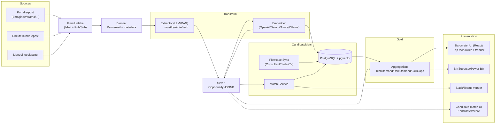

```mermaid
flowchart LR
  subgraph Sources
    P1["Portal e-post<br/>(Emagine/Verama/...)"]
    P2["Direkte kunde-epost"]
    P3["Manuell opplasting"]
  end

  P1 & P2 & P3 --> GI["Gmail Intake<br/>(label + Pub/Sub)"]
  GI --> BZ["Bronze:<br/>Raw email + metadata"]

  subgraph Transform
    EX["Extractor (LLM/RAG)<br/>→ must/bør/role/tech"]
    EM["Embedder<br/>(OpenAI/Gemini/Azure/Ollama)"]
  end

  BZ --> EX --> SV["Silver:<br/>Opportunity JSONB"]
  SV --> EM --> SV

  subgraph CandidateMatch
    FC["Flowcase Sync<br/>(Consultant/Skills/CV)"]
    PG[("PostgreSQL + pgvector")]
    MT["Match Service"]
  end

  SV --> MT
  FC --> PG
  MT --> PG
  EM --> PG

  subgraph Gold
    AGG["Aggregations<br/>TechDemand/RoleDemand/SkillGaps"]
  end

  SV --> AGG
  PG --> AGG

  subgraph Presentation
    UI["Barometer UI (React)<br/>Top tech/roller + trender"]
    CMUI["Candidate-match UI<br/>Kandidater/score"]
    BI["BI (Superset/Power BI)"]
    SL["Slack/Teams varsler"]
  end

  AGG --> UI & BI
  SV --> CMUI
  MT --> SL
```
